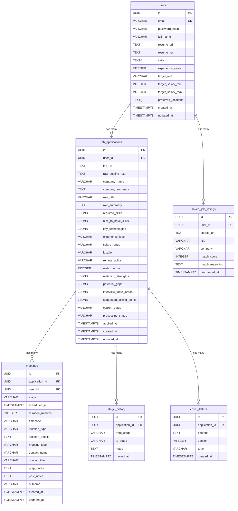

# RolePilot

An AI-powered job application tracker that helps you manage your job search, analyze job postings, and prepare for interviews.

## Features

- **Job Application Tracking** — Kanban-style board with stages: Applied → Recruiter Response → Phone Screen → Technical Interview → Onsite → Offer → Accepted/Rejected/Withdrawn
- **AI Job Analysis** — Paste a job posting and AI extracts company info, required skills, salary range, and more
- **Resume Matching** — Upload your resume and get a match score, strengths, gaps, and suggested talking points for each application
- **Stage History** — Full audit trail with notes at every stage transition
- **Cover Letter Generation** — AI-generated cover letters tailored to each job (coming soon)

## Tech Stack

- **Backend:** Go, Chi router
- **Database:** PostgreSQL
- **AI:** Anthropic Claude API
- **Auth:** JWT

## Getting Started

### Prerequisites

- Go 1.22+
- PostgreSQL
- [Anthropic API key](https://console.anthropic.com/)
- poppler (for PDF text extraction): `brew install poppler`

### Setup

1. Clone the repo:
   ```bash
   git clone https://github.com/alissacrane123/rolepilot-backend.git
   cd rolepilot-backend
   ```

2. Create the database:
   ```bash
   createdb rolepilot
   ```

3. Run migrations:
   ```bash
   psql postgres://localhost:5432/rolepilot -f migrations/001_init.sql
   ```

4. Create your `.env` file:
   ```bash
   cp .env.example .env
   ```
   Then fill in your `DATABASE_URL`, `JWT_SECRET`, and `ANTHROPIC_API_KEY`.

5. Install dependencies and run:
   ```bash
   go mod tidy
   go run cmd/server/main.go
   ```

## API Endpoints

### Auth
| Method | Endpoint | Description |
|--------|----------|-------------|
| POST | `/api/auth/register` | Create account |
| POST | `/api/auth/login` | Login, returns JWT |

### Profile
| Method | Endpoint | Description |
|--------|----------|-------------|
| GET | `/api/profile` | Get your profile |
| PATCH | `/api/profile` | Update skills, experience, preferences |
| POST | `/api/profile/resume` | Upload resume file (PDF, TXT, MD) |
| POST | `/api/profile/resume/text` | Paste resume text directly |

### Applications
| Method | Endpoint | Description |
|--------|----------|-------------|
| POST | `/api/applications` | Create application (triggers AI analysis) |
| GET | `/api/applications` | List all applications |
| GET | `/api/applications/board` | Board view grouped by stage |
| GET | `/api/applications/{id}` | Application detail with AI data |
| PATCH | `/api/applications/{id}/stage` | Move to new stage with notes |
| GET | `/api/applications/{id}/history` | Full stage transition history |

### Meetings
| Method | Endpoint | Description |
|--------|----------|-------------|
| POST | `/api/applications/{id}/meetings` | Add meeting to an application |
| GET | `/api/applications/{id}/meetings` | List meetings for an application |
| GET | `/api/meetings/upcoming` | All upcoming meetings (for calendar) |
| PATCH | `/api/meetings/{meetingId}` | Update meeting details/notes/outcome |
| DELETE | `/api/meetings/{meetingId}` | Delete a meeting |

## Project Structure

```
rolepilot-backend/
├── cmd/server/main.go           # Entry point, routes
├── internal/
│   ├── database/
│   │   ├── db.go                # Connection pool, user queries
│   │   ├── application.go       # Application + stage queries
│   │   └── meeting.go           # Meeting CRUD queries
│   ├── handler/
│   │   ├── auth.go              # Register, login, profile, resume upload
│   │   ├── application.go       # CRUD, stage transitions, AI trigger
│   │   ├── meeting.go           # Meeting CRUD + upcoming
│   │   ├── helpers.go           # Response helpers
│   │   └── pdf.go               # PDF text extraction
│   ├── middleware/
│   │   └── auth.go              # JWT middleware
│   ├── models/
│   │   └── models.go            # All types and request/response structs
│   └── services/
│       └── ai.go                # Claude API integration
├── migrations/
│   ├── 001_init.sql             # Database schema
│   └── 002_meetings.sql         # Meetings table
├── .env.example
└── go.mod
```


## Database Schema
